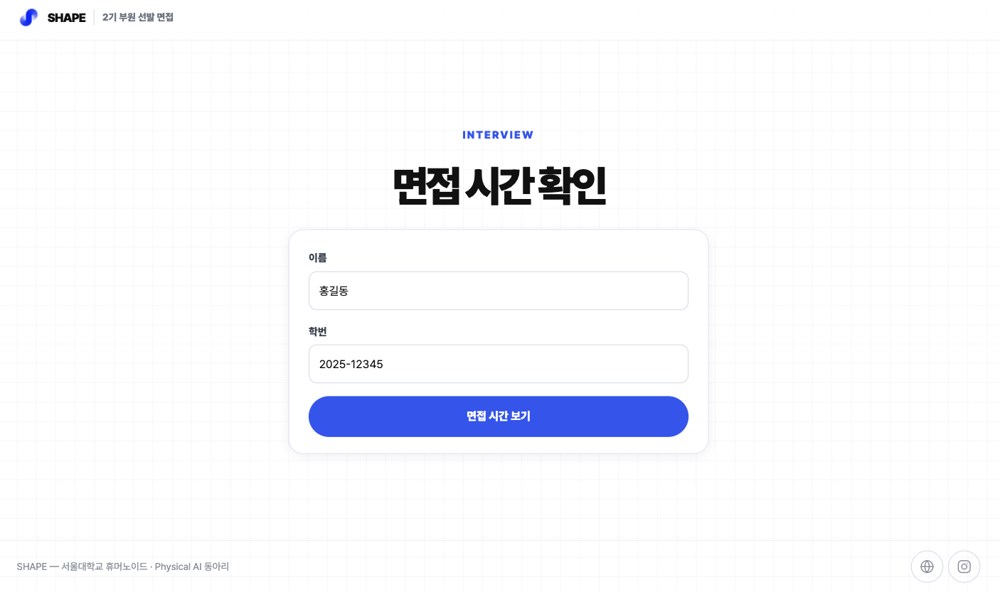
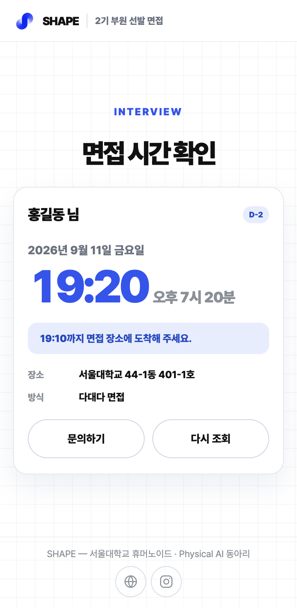
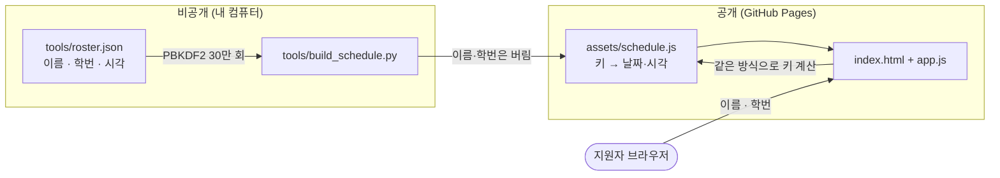

# shape-interview — 지원자가 자기 면접 시간만 찾아가는 한 장짜리 웹

SHAPE 2기 부원 선발 면접 대상자 53명에게 개인별 시간을 알리려고 만든 정적 페이지임.
안내 메일에 링크 하나만 넣고, 지원자는 이름과 학번을 넣어 **본인 것만** 본다.
저장소는 공개인데 명단에는 실명과 학번이 들어 있어서, **결과물에 이름도 학번도 남기지
않는 방식**으로 만든 것이 이 저장소의 전부라고 해도 됨.

> A one-page static site that lets each applicant look up their own interview time.
> The published bundle contains no names and no student IDs — only PBKDF2 lookup keys,
> so the schedule can live in a public repo without leaking who is on it.

<table>
<tr>
<td width="64%"></td>
<td width="36%" align="center"></td>
</tr>
<tr>
<td align="center"><sub><b>1240×740</b> — 들어오면 보이는 화면. 스크롤 없음</sub></td>
<td align="center"><sub><b>390×780</b> — 조회하면 입력칸 <b>자리를</b> 결과가 대신함</sub></td>
</tr>
</table>

---

## 무엇을 하는가

| 단계 | 내용 |
|---|---|
| 1 | 지원자가 이름과 학번을 입력함 |
| 2 | 브라우저가 `PBKDF2-HMAC-SHA256(이름\|학번, salt, 30만 회)` 로 조회 키를 만듦 |
| 3 | `assets/schedule.js` 의 키 표에서 그 키를 찾음 |
| 4 | 찾으면 날짜·시작 시각·도착 권장 시각·장소를 보여 주고, 문의처를 함께 안내함 |
| 5 | 시간이 아직 안 잡힌 사람은 "개별 조율 중" 안내, 없는 사람은 다시 확인하라는 안내 |

입력값은 서버로 가지 않음. 백엔드가 없고, 네트워크 요청 자체를 하지 않음.

## 구조



## 구성

```
index.html                  한 장짜리 화면
assets/app.js               조회 · 결과 그리기 · 문의 대화상자
assets/app.css              이 페이지에만 필요한 스타일
assets/shape-kit.css        SHAPE 디자인 키트 (sesepark/shape-web-design 사본)
assets/schedule.js          생성물. 조회 키 표
tools/roster.json           원본 명단. .gitignore 로 막아 둠
tools/roster.example.json   그 명단의 형식만 보여 주는 예시
tools/build_schedule.py     명단 → 키 표
```

## 설계에서 신경 쓴 부분

- **이름과 학번을 아예 싣지 않음** — 공개 저장소에 53명의 실명과 학번을 두는 것은
  선택지가 아니었음. 그렇다고 서버를 세우면 링크 하나 보내자고 배포·운영이 붙음.
  그래서 명단을 **조회 키만 남긴 표**로 바꿔 실었음. 배포물에는 `이름|학번` 에서 나온
  16바이트 해시와 날짜·시각뿐이고, 원본 `roster.json` 은 저장소에 올라가지 않음.
  결과가 맞다는 것은 브라우저가 같은 키를 다시 만들어 찾아지는 것으로 확인함.

- **평범한 해시가 아니라 PBKDF2 30만 회** — SHA-256 한 번이면 학번 형식(`20XX-XXXXX`,
  약 80만 가지)을 전부 돌려 보는 데 몇 초면 됨. 반복을 30만 회로 올려 한 번 계산에
  약 0.05초가 들게 했음. 지원자는 조회 한 번에 그 값을 한 번만 치르지만, 대입하는 쪽은
  경우의 수만큼 곱해서 치러야 함.

- **학번만의 색인을 만들지 않음** — 처음에는 "학번은 맞는데 이름이 다릅니다" 를
  알려 주려고 학번 해시 목록을 따로 실으려 했음. 그런데 그 목록이 있으면 학번 공간을
  훑어 **명단에 든 학번 53개를 골라낼 수** 있고, 그다음엔 이름만 대입하면 됨.
  안내 문구 하나 때문에 공격 비용을 몇 자리 낮추는 셈이라 목록을 빼고, 대신 못 찾았을 때
  "이름과 학번이 지원서와 한 글자라도 다르면 찾지 못한다" 고 적어 스스로 고치게 했음.

- **입력을 다듬는 규칙이 파이썬과 자바스크립트에서 같아야 함** — `홍 길 동` 도
  `202512345` 도 같은 키가 나와야 하는데, 만드는 쪽은 파이썬이고 찾는 쪽은
  자바스크립트임. 그래서 `casefold()` 가 아니라 `lower()` 를, `\D` 가 아니라
  `[^0-9]` 를 씀. 둘 다 파이썬이 유니코드까지 보고 자바스크립트는 아스키만 보는
  차이가 있어서, 같은 결과를 내는 쪽으로 맞춘 것임. 빌드 뒤 53명 전부에 대해
  양쪽 키가 일치하는지 확인함.

- **요일은 만들 때 확정함** — 브라우저 시계가 어떤 시간대에 있든 "9월 11일 금요일" 은
  같아야 해서, 요일 글자를 빌드 시점에 계산해 표에 넣었음. 남은 날짜(`D-2`, `내일`)만
  브라우저에서 계산하는데, 이때도 사용자의 시간대를 한국 시각으로 되돌린 뒤 비교함.

- **스크롤 없이 한 화면에서 끝냄** — 결과를 입력칸 **아래에** 붙이면 휴대전화에서는
  자판이 올라온 채로 스크롤을 해야 시간이 보임. 그래서 결과가 입력칸 **자리를 대신하게**
  했음(`form.hidden` ↔ `result.hidden`). 세로 배치는 `100svh` 기준이고, 가운데 정렬은
  `align-items:center` 가 아니라 `margin:auto` 로 했음 — 내용이 화면보다 길어질 때
  전자는 위쪽을 잘라 버리기 때문임. 세로가 짧아지는 순서대로 제목 → 여백 →
  입력칸 높이 → 꼬리글을 깎는 분기(`700px`·`620px`·`480px`·`400px`)를 뒀음.
  320×568 부터 1920×1080 까지 13가지 크기에서 **입력 화면과 결과 화면 모두 스크롤이
  생기지 않는 것**을 확인했고, 휴대전화를 가로로 눕힌 740×360 에서만 39px 넘침.

- **디자인은 새로 짓지 않고 키트를 그대로 씀** — 색·글자·모서리·그림자를 임의로 정하면
  같은 동아리의 다른 화면과 어긋남. `sesepark/shape-web-design` 의 `shape-kit.css` 를
  그대로 두고, 이 페이지에만 필요한 스타일만 `app.css` 에 `--sh-*` 토큰으로 덧붙였음.
  가로 넘침이 없는 것과 누를 것이 44px 이상인 것을 함께 확인함.

## 실행

```bash
python3 tools/build_schedule.py     # tools/roster.json → assets/schedule.js
python3 -m http.server 8000         # http://localhost:8000
```

`tools/roster.json` 은 `tools/roster.example.json` 과 같은 형식임. `date` 와 `start`
(자정부터의 분)를 넣으면 시각이 잡힌 사람, `"status": "pending"` 이면 개별 조율 중인
사람으로 들어감. `salt` 는 이미 만들어진 `assets/schedule.js` 에서 다시 읽어 쓰므로
여러 번 돌려도 바뀌지 않음.

## 관련 저장소

- [sesepark/shape-web-design](https://github.com/sesepark/shape-web-design) — 여기 쓴 디자인 키트의 원본
- [sesepark/shape-new-web](https://github.com/sesepark/shape-new-web) — SHAPE 의 공개 웹사이트이자 내부 운영 시스템

## 한계와 주의

- 시간표는 **만들 때 고정된 사본**임. 원본 배정표에서 시간을 바꾸면 `roster.json` 을
  고쳐 다시 빌드하고 push 해야 반영됨.
- 학번 형식은 `20XX-XXXXX` 아홉 자리로 못 박혀 있음(`app.js` 의 길이 검사).
- 조회 키가 브라우저에서 계산되므로 **특정 한 사람이 명단에 있는지**는 그 사람의 이름과
  학번을 아는 쪽에서 확인할 수 있음. 막을 수 있는 것은 명단 전체를 긁어 가는 쪽이고,
  이 방식으로 막는 것도 거기까지임.
- `crypto.subtle` 이 없는 환경(HTTPS 가 아닌 오래된 브라우저)에서는 조회가 안 되고
  안내 문구만 뜸.
